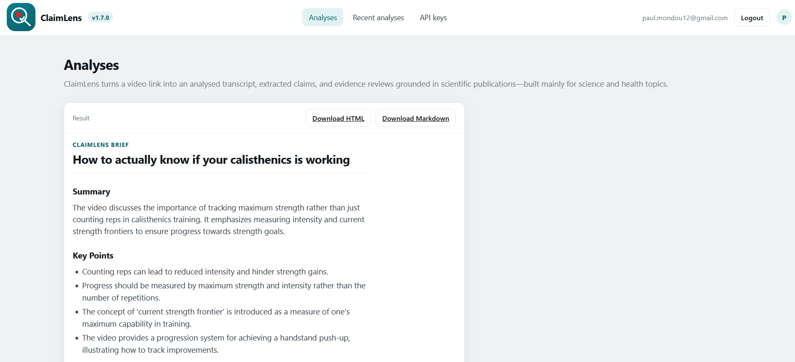

# ClaimLens

ClaimLens turns a YouTube video into a readable analysis brief: subtitles are collected, cleaned,
sent through a structured OpenAI analysis, and converted into a report you can inspect, download,
archive, and optionally check against scientific literature.

The tool is built for the moment where a video sounds convincing but you need something more useful
than a transcript and less fragile than a gut feeling. Paste one URL, let the run finish, then read a
brief that separates the video's core points, notable claims, caveats, and evidence status. For
science and health topics, ClaimLens can extend the run with PubMed and Semantic Scholar retrieval so
the reader sees which claims have supporting, contradicting, or merely contextual sources.

## Why it is useful

Video is a poor review format. Important claims are scattered across minutes of speech, timestamps are
hard to compare, and a polished speaker can make unsupported details feel established. ClaimLens
changes the unit of review from "watch this again" to "read the brief, inspect the claims, open the
sources that matter."

The practical payoff is speed and traceability:

- A single URL becomes a persisted run with transcript, analysis, brief, and optional verification.
- The finished brief is the default reading surface, not a hidden export.
- Recent analyses stay reopenable, so old work is not lost after closing the active workspace.
- Saved API keys are encrypted per user, while guests can still bring keys for one run.
- Provider failures are reported as limits, not silently converted into fake confidence.

## Screenshots

This release is specifically correcting the completed-brief layout shown below. The previous result
card was narrow and left aligned, leaving most of the page unused even after the run had finished.
The completed workspace now gives the saved brief a full-width report card by default while keeping
run details behind an accessible disclosure.



Recommended screenshots to refresh after starting the local server:

| Surface | What the screenshot should prove |
| --- | --- |
| `docs/screenshots/analysis-launcher.png` | One URL launches the whole chain from the Analyses page. |
| `docs/screenshots/completed-brief.png` | A finished brief owns the page width by default. |
| `docs/screenshots/recent-analyses.png` | Old analyses scan by `video_id : video title`, with the title emphasized. |
| `docs/screenshots/options-api-keys.png` | A signed-in user can save and test encrypted provider keys. |

## Product Tour

1. Paste one YouTube URL.
2. ClaimLens extracts existing captions from YouTube or the configured Supadata native-caption path.
3. If captions are unavailable, the run stops honestly and offers a pasted transcript fallback.
4. The transcript is cleaned into readable paragraphs and bounded for LLM input.
5. OpenAI returns structured analysis: summary, key points, notable claims, caveats, and editorial
   notes.
6. ClaimLens generates a Markdown brief and a browser-readable HTML view.
7. If source verification was requested and enabled, ClaimLens searches PubMed and Semantic Scholar,
   grades retrieved abstracts, and writes a source-verification section into the report.
8. The Analyses page live-updates without a reload, then switches into a brief-first reading
   workspace when the report exists.
9. The run can be closed from the workspace and reopened later from Recent analyses.

## What You Get

Each completed run keeps the artifacts a reviewer actually needs:

- Cleaned transcript: readable text, viewable in the app and downloadable as plain text.
- Analysis brief: Markdown artifact plus browser view and self-contained HTML download.
- Evidence summary: claim counts, evidence counts, source-verification status, and provider limits.
- Run details: terminal status, source video link, outputs, and warnings recoverable from the
  completed workspace disclosure.
- History row: video code and title on the same primary line so old work can be recognized quickly.

## Trust Model

ClaimLens is deliberately conservative. It does not claim a video is true or false because a search
result shares keywords with a claim. Retrieval finds candidate papers; grading decides whether each
abstract supports, contradicts, or only contextualizes the claim. When grading is unavailable, source
links remain useful, but verdicts stay unclear.

Provider limits are also visible. A rate limit, timeout, missing abstract, or source-verification
warning is recorded as a warning instead of being presented as a fully verified report. That matters
for health and science content, where overclaiming certainty is worse than saying "not enough
evidence was retrieved."

## Local-First Shape

The refined MVP is local-first:

1. Enter one YouTube video URL.
2. Extract existing YouTube subtitles.
3. Stop with a clear failure if subtitles are unavailable.
4. Clean the transcript for LLM input.
5. Use OpenAI to generate a structured analysis.
6. Generate a Markdown brief.
7. Optionally verify notable claims against PubMed and Semantic Scholar, grading each retrieved
   abstract as supporting, contradicting, or contextual.
8. Inspect progress on a local HTML process page with guarded POST actions, live async job status,
   and report viewing/download.
9. Optionally log in to reuse encrypted per-user API keys and manage them from Options.

Steps 2 to 6 run as one chain: submitting a URL launches the analysis and it advances through to the
brief without further clicks. The chain stops at the first failure and leaves that step retryable, so
the page always offers the next useful action. It also pauses before a step whose input is genuinely
missing: with no resolvable OpenAI key the run is marked as waiting and the page asks for the key
instead of burning the step. Nothing needs a page reload: the process page patches itself from a
run-scoped JSON endpoint.

Channel monitoring and candidate scoring are no longer base MVP requirements. Advanced source
verification is optional, disabled by default at deployment level, and opted into per analysis with
the checkbox on the launcher before the pipeline starts. When requested it runs after the brief,
checks stored notable claims against PubMed and Semantic Scholar candidates, and renders a
source-verified brief.

## Local Development

Create a virtual environment and install the project:

```bash
python3 -m venv .venv
source .venv/bin/activate
python -m pip install -e ".[dev]"
```

Run the CLI:

```bash
claimlens --help
claimlens init-db
claimlens run-video https://www.youtube.com/watch?v=W7DVR9TlpOs --database data/claimlens.sqlite3
```

Run quality checks:

```bash
ruff check .
pytest
```

## Configuration

ClaimLens reads local configuration from `config/claimlens.example.toml` by default, resolved from
the current working directory. Run the CLI from the repository root for the default local workflow.
For deployed execution, set `CLAIMLENS_CONFIG` or pass `--config`; relative paths inside an
explicit config file resolve from that file's directory.

Relevant environment variables:

```bash
CLAIMLENS_DB=data/claimlens.sqlite3
CLAIMLENS_OUTPUTS=outputs
CLAIMLENS_TRANSCRIPTS=outputs/transcripts
CLAIMLENS_BRIEFS=outputs/briefs
CLAIMLENS_CONFIG=config/claimlens.example.toml
CLAIMLENS_HOST=127.0.0.1
CLAIMLENS_PORT=8765
CLAIMLENS_KAPSULE_DB=
CLAIMLENS_KEY_ENCRYPTION_SECRET=
CLAIMLENS_KEY_ENCRYPTION_KEY_ID=primary
CLAIMLENS_KEY_ENCRYPTION_PREVIOUS=
CLAIMLENS_TRUSTED_PROXY_IPS=
CLAIMLENS_MAX_QUEUED_JOBS=16
CLAIMLENS_JOB_WORKERS=4
CLAIMLENS_ADVANCED_SOURCE_VERIFICATION=false
CLAIMLENS_ENABLE_PUBMED=true
CLAIMLENS_ENABLE_SEMANTIC_SCHOLAR=true
CLAIMLENS_ENABLE_WEB_SEARCH=false
CLAIMLENS_SECURE_COOKIES=false
CLAIMLENS_REGISTRATION_ENABLED=false
CLAIMLENS_ALLOW_SERVER_API_KEY_FALLBACK=true
CLAIMLENS_TRANSCRIPT_PROVIDER_ORDER=youtube
CLAIMLENS_SUPADATA_LANGUAGE=en
CLAIMLENS_SUPADATA_TIMEOUT_SECONDS=10
OPENAI_API_KEY=
SEMANTIC_SCHOLAR_API_KEY=
NCBI_API_KEY=
```

`OPENAI_API_KEY` is required for the LLM analysis step. It can be supplied through the environment,
`--openai-api-key`, or the local HTML UI and is not persisted in SQLite, generated transcripts, or
generated briefs.

Authenticated web users can save OpenAI, Semantic Scholar, and NCBI/PubMed keys from the Options
page. Saved keys are encrypted in SQLite with `CLAIMLENS_KEY_ENCRYPTION_SECRET`; keep that secret
outside Git and back it up separately. Guest users can still enter keys per process, and those keys
are used only for the submitted job/action. On the Process page, signed-in users with a saved key
do not see a redundant per-run key field; guests and users without that provider key can still enter
one for the submitted action.

New saved keys use an AES-GCM `v3:key_id` envelope. To rotate, configure the new active encryption
secret and key ID, retain the former key in `CLAIMLENS_KEY_ENCRYPTION_PREVIOUS` (a JSON mapping),
back up the database, then run `claimlens rotate-secrets`.

Authenticated users can also save multiple Supadata keys from Options. Supadata transcript fetching
is opt-in through configuration. Local runs keep the classic YouTube path by default; the deployed
Compose service sets `CLAIMLENS_TRANSCRIPT_PROVIDER_ORDER=supadata,youtube` so native Supadata
captions are tried first and YouTube is used only as an explicit fallback:

```toml
[transcripts]
provider_order = ["supadata", "youtube"]
supadata_monthly_request_cap = 100
supadata_language = "en"
supadata_timeout_seconds = 10
```

ClaimLens always calls Supadata in native subtitle mode:

```bash
curl --request GET \
  --url 'https://api.supadata.ai/v1/transcript?url=https%3A%2F%2Fwww.youtube.com%2Fwatch%3Fv%3DVIDEO_ID&lang=en&text=false&mode=native' \
  --header 'x-api-key: <SUPADATA_API_KEY>'
```

The application does not expose or call Supadata `auto`, `generate`, translation, extract, or file
transcription modes. Saved Supadata keys are tried by priority; keys already exhausted in local
bookkeeping are skipped, and transcript quota responses mark a key exhausted until the next billing
month. The transcript request does not call `/me` first, so successful native captions avoid the
account preflight latency. `CLAIMLENS_SUPADATA_TIMEOUT_SECONDS` overrides the 10-second request
timeout. When all native Supadata keys are exhausted, invalid, or missing, the configured YouTube
fallback is attempted; if no provider succeeds, the pasted transcript fallback remains available.

When `CLAIMLENS_KAPSULE_DB` points to a readable Kapsule SQLite database, ClaimLens also accepts
existing Kapsule email/password credentials. The Kapsule database is read-only from ClaimLens; the
first successful Kapsule login provisions a local ClaimLens user row so ClaimLens-owned API keys,
runs, and sessions remain isolated in the ClaimLens database.

### How a claim gets a verdict

Retrieval alone cannot decide anything: finding a paper about tendons says nothing about whether it
backs a claim about tendons. Verification therefore runs in two stages.

1. **Retrieve.** PubMed and Semantic Scholar are queried per claim. Semantic Scholar withholds many
   abstracts, so its `tldr` summary is used as a second-best evidence text; a record with neither is
   flagged as title-only. Requests to each provider are paced, and a rate-limited provider is retried
   with backoff before the claim gives up on it.
2. **Grade.** Each retrieved abstract is graded against the claim as `supports`, `contradicts`, or
   `context`, with a one-sentence rationale and a confidence. Only supporting and contradicting
   grades become evidence; everything else stays a linked source. The grader is deliberately strict:
   sharing a topic is not support, a quantified claim needs a comparable figure, and anything
   uncertain falls back to `context`. Over-claiming support is the worst error for health content.

The claim verdict follows from the grades — `supported`, `contradicted`, `mixed`, or `unclear` when
sources were found but none settled the question. Grading needs an OpenAI key. Without one, sources
are still retrieved and linked, and every verdict stays `unclear`.

A provider that returns nothing for a claim is a normal outcome and does not degrade the run; only a
provider that could not be reached does.

Advanced source verification is disabled by default. Every `[sources]` flag below also reads an
environment variable that takes precedence over the file, because a container ships a read-only TOML:
set `CLAIMLENS_ADVANCED_SOURCE_VERIFICATION=true` to expose the per-analysis opt-in on the launcher
without rebuilding the image.

```toml
[pipeline]
source_verification_max_results = 5
source_verification_timeout_seconds = 20
analysis_max_chars = 60000
report_language = "en"

[web]
max_request_bytes = 16384
rate_limit_actions = 12
rate_limit_window_seconds = 300

[sources]
advanced_source_verification = false
enable_pubmed = true
enable_semantic_scholar = true
enable_web_search = false
```

`report_language` is a deployment setting: every new analysis uses it, and the launcher does not ask
for a language.

The Process page polls a run-scoped JSON endpoint every two seconds while a job is active and backs
off to fifteen seconds when idle, so a run that becomes active again — from the chain, a retry, or
another tab — is picked up without a reload. It also stays on the fast rhythm for as long as the
state keeps changing, so a chain that is briefly between two jobs is not mistaken for an idle run.
Polling pauses on a hidden tab and resumes when the tab becomes visible. After repeated failed polls
the page says that live updates are unavailable, and takes the notice back down on the first success.
It displays semantic status and messages rather than a numeric percentage, because external provider
calls do not expose reliable intermediate progress.

The tracking client is served from `/static/live-status.js` and configured through data attributes,
so the deployment keeps `script-src 'self'` with no inline-script exception. No page uses an inline
script or an inline event handler, and `tests/test_workspace_deliverables.py` sweeps every page to
keep it that way.

Deliverables are reached through the app, never through a server path:

| Route | Purpose |
| --- | --- |
| `/transcript?run_id=N` | Read the cleaned transcript of one authorized run |
| `/transcript/download?run_id=N` | The same transcript as a plain-text file |
| `/brief?run_id=N` | Read the brief in the app |
| `/brief/download?run_id=N&format=html` | A self-contained HTML brief that also prints cleanly |
| `/brief/download?run_id=N` | The stored Markdown artifact, unchanged |

A run that belongs to another account or guest answers 403; a run or artifact that does not exist
answers 404.

A finished analysis can be closed from the workspace once its whole chain is terminal. Closing is a
visibility change only: nothing is deleted, the run stays in Recent analyses, and reopening it brings
the result and the brief back to the workspace. A run that is still working — including one paused
for a key — cannot be closed.

The in-process queue is bounded by `CLAIMLENS_MAX_QUEUED_JOBS` (16 by default). A worker owns a run
for the whole chain, so `CLAIMLENS_JOB_WORKERS` (4 by default, capped at 16) is the number of
analyses that can progress at once. `/health/jobs` reports queued/running/failed counts and the most
recent job failure for internal monitoring.

The source verification keys are optional for local tests and some API usage, but should be supplied
for real PubMed/Semantic Scholar smoke testing. They are runtime/config inputs only and are not
persisted in SQLite, generated transcripts, generated briefs, or the local HTML output.
PubMed and Semantic Scholar can run without keys; saved or environment keys only improve quota and
reliability. The source switches control which adapters are called. Verification reports list each
adapter outcome, including no candidates, timeouts, and rate limits. A run with warnings is not
presented as fully source-verified; a provider HTTP 429 activates a provider cooldown and is shown
with remediation guidance instead of triggering repeated per-claim calls.

## Current Implementation

Implemented:

- Python package and CLI shell.
- Config loading.
- SQLite schema initialization.
- Single-video run state.
- URL validation for one YouTube video URL.
- Mandatory subtitle extraction with persisted failure causes.
- Transcript and segment persistence in SQLite.
- Cleaned transcript artifacts reflowed into readable paragraphs while raw timestamped segments remain
  available.
- Mockable OpenAI analysis boundary and structured analysis storage.
- Direct Markdown brief generation labeled as not advanced-source-verified.
- Optional PubMed/Semantic Scholar source verification for stored notable claims.
- Non-binary claim verdicts: supported, contradicted, mixed, unclear, and not_checked.
- Source-verified Markdown brief generation with supporting/contradicting evidence snippets.
- Local HTML process page with CSRF-protected actions, bounded request bodies, live job state,
  semantic status messages, failure details, transcript preview, source links, report viewing,
  report download, and next-step controls.
- Login/logout, secure session storage, top navigation, and an Options page for encrypted per-user
  API key management.
- Optional Kapsule account login bridge for shared paulmondou.fr credentials.
- Pasted transcript fallback for VPS/IP-blocked YouTube caption extraction.
- SQLite WAL and `busy_timeout` pragmas for local concurrent web access.
- SQLite-backed web action limits keyed by authenticated account or guest token, so Caddy's proxy IP
  does not pool every user's action quota.
- Orphaned in-process jobs are marked interrupted at application startup and can be retried.
- Conservative source verification: adapter errors are logged, and verdicts come from grading the
  retrieved abstracts rather than from title/snippet keyword polarity.

Manual smoke test:

1. Successful path with a real captioned video:

```bash
export OPENAI_API_KEY=...
claimlens init-db --database data/claimlens.sqlite3
claimlens run-video "https://www.youtube.com/watch?v=W7DVR9TlpOs" --database data/claimlens.sqlite3
```

2. Expected stopped path with a video that has no YouTube captions:

```bash
claimlens run-video "https://www.youtube.com/watch?v=<no-caption-video-id>" --database data/claimlens.sqlite3
```

The second path should stop at the captions step with a persisted message explaining that subtitles
are unavailable and the base MVP does not use audio fallback.

3. Optional source verification after a successful analysis:

```bash
export SEMANTIC_SCHOLAR_API_KEY=...
export NCBI_API_KEY=...
export OPENAI_API_KEY=...        # grades the retrieved abstracts
claimlens verify-sources "W7DVR9TlpOs" --database data/claimlens.sqlite3
claimlens brief "W7DVR9TlpOs" --verified --database data/claimlens.sqlite3
```

Pass `--no-grading` to retrieve and link sources without judging them; every verdict then stays
`unclear`. `--openai-api-key` overrides the environment for the grading step only.

This writes `outputs/briefs/<video_id>.verified.md` when usable candidates are retrieved, or
`outputs/briefs/<video_id>.verification-attempt.md` when a provider could not be reached. Each piece
of evidence is rendered with the grader's reason and the cited text, and the claim line carries the
mean grading confidence. The verified brief includes a human-review
disclaimer because PubMed/Semantic Scholar snippets are review aids, not final medical advice or
scientific authority.

4. HTML workflow:

```bash
claimlens serve
```

Open `http://127.0.0.1:8765` and submit a URL; the analysis runs through to the brief on its own.
Tick "Check claims against PubMed and Semantic Scholar" before submitting to extend the chain with
source verification (requires `advanced_source_verification = true` in the deployment config).
The page shows job status, verification status, failure details, source counts, transcript preview,
and links to view or download the generated Markdown report.

For a private local login test:

```bash
export CLAIMLENS_KEY_ENCRYPTION_SECRET="$(openssl rand -hex 32)"
export CLAIMLENS_SECURE_COOKIES=false
claimlens serve
```

Open `/login`. If no user exists, the create-account form bootstraps the first account even when
registration is otherwise closed. After login, use `/options` to save, test, or delete API keys.

Online-readiness smoke checks:

- Oversized or stale form submissions should be rejected with controlled messages.
- Repeated costly actions should be rejected while the same action is queued or running.
- Report links must only serve files from the configured briefs directory.
- Channel page scraping is disabled in the exposed CLI workflow; use one direct video URL.
- If YouTube blocks transcript extraction, paste transcript text into the fallback form and continue
  with cleanup, analysis, brief, and verification.

Deployment notes:

- ClaimLens now supports BYO keys for guests and encrypted saved keys for authenticated users.
  Keep `CLAIMLENS_ALLOW_SERVER_API_KEY_FALLBACK=false` if you do not want any server-owned key use.
- HTTPS still belongs at Caddy/reverse-proxy level. Do not publish the ClaimLens container port
  directly. The deployable app shape is documented in `docs/deployment-paulmondou-infra.md`.

## SQLite Schema

Schema version 8 creates and migrates the local tables for pipeline state, analysis, verification,
brief artifacts, async jobs, web users, sessions, encrypted API keys, and Supadata key pools:

- `channels`
- `videos`
- `pipeline_runs`
- `run_steps`
- `transcripts`
- `transcript_segments`
- `cleaned_transcripts`
- `summaries`
- `claims`
- `sources`
- `claim_sources`
- `verification_runs`
- `evidence_snippets`
- `brief_artifacts`
- `jobs`
- `users`
- `sessions`
- `user_api_keys`
- `supadata_api_keys`

Version 8 adds `pipeline_runs.closed_at`, which records that an owner closed a finished analysis. It
is additive and nullable, so an existing database keeps every run visible until someone closes one.

Before introducing the next schema version, any additive or destructive production schema change
must include a tested migration path against an older schema/database fixture.

## Refined Command Surface

Target MVP commands:

```bash
claimlens init-db
claimlens run-video <youtube_video_url>
claimlens transcribe <youtube_video_url>
claimlens analyze <video_id>
claimlens brief <video_id>
claimlens verify-sources <video_id>
claimlens brief <video_id> --verified
claimlens serve
```

Existing compatibility placeholders such as `ingest`, `candidates`, and `run-daily` may remain
temporarily, but they are not part of the refined base MVP.
