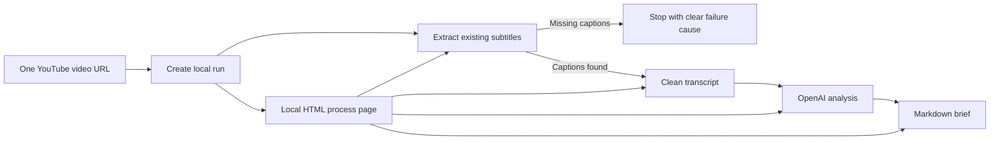

# ClaimLens MVP Roadmap

## Product Definition

ClaimLens is a local-first pipeline for turning one YouTube video URL into a reviewable brief.
The refined MVP deliberately starts with a single video URL, requires existing YouTube subtitles,
uses OpenAI for analysis, and produces a Markdown brief plus a local HTML process page.

The old channel-monitoring and candidate-selection flow is no longer part of the base MVP. Those
capabilities can return later as batch inputs once the one-video workflow is reliable.

## MVP Success Criteria

- A user can enter one YouTube video URL.
- A user can provide an OpenAI API key at the start of the run through environment/config or an
  interactive prompt/UI field.
- The system validates the URL and records a local run state.
- The system extracts existing YouTube subtitles only.
- If subtitles are unavailable, the pipeline stops and explains the cause.
- The system cleans subtitle text by removing timestamps and obvious transcript noise while keeping
  raw segments for audit/debug.
- The system uses OpenAI to generate a structured analysis from the cleaned transcript.
- The system generates a reviewable Markdown brief directly after LLM analysis.
- The generated brief clearly states that advanced source verification has not been run.
- A local HTML process page shows each step, output, failure cause, and next eligible action.
- The implementation remains local-first and can later be hosted on a VPS without a rewrite.

## Base MVP Pipeline



## Stage 0: Local Run Setup

Scope:

- Accept a single YouTube video URL.
- Parse supported YouTube URL forms into one video ID.
- Require an OpenAI API key at run start, from `OPENAI_API_KEY`, config, prompt, or the local UI.
- Never persist the OpenAI API key in SQLite, Markdown, HTML outputs, or logs.
- Persist run state, current step, step status, and failure details locally.

Deliverable: a run can be created for exactly one video URL.

## Stage 1: Mandatory Subtitle Extraction

Scope:

- Fetch YouTube captions/subtitles when available.
- Do not download audio.
- Do not fall back to OpenAI audio transcription.
- Stop the pipeline if captions are unavailable.
- Store raw transcript segments in SQLite for audit/debug.
- Persist the failure cause when extraction cannot continue.

Deliverable: subtitle extraction either produces reusable raw segments or stops with a clear cause.

## Stage 2: Transcript Cleanup

Scope:

- Convert raw subtitle segments into cleaned plain text.
- Remove timestamp labels from the LLM input.
- Normalize whitespace and repeated line breaks.
- Reduce obvious ASR artifacts conservatively without changing meaning.
- Store or export cleaned transcript text as the canonical LLM input.

Deliverable: a timestamp-free cleaned transcript is available for analysis.

## Stage 3: OpenAI Analysis

Scope:

- Use OpenAI with a mockable client boundary.
- Generate structured output:
  - concise summary
  - key points
  - notable claims
  - caveats
  - editorial notes
- Store the structured analysis in SQLite in a way compatible with later source verification.
- Fail clearly when the API key is missing or the OpenAI request fails.

Deliverable: `claimlens analyze <video_id>` or the run flow stores structured analysis.

## Stage 4: Direct Markdown Brief

Scope:

- Generate one Markdown brief per processed video.
- Include video URL and metadata available locally.
- Include transcript status and analysis summary.
- Include notable claims and caveats.
- Clearly label source status as `not advanced-source-verified`.
- Write to configurable output paths such as `outputs/briefs/<video_id>.md`.

Deliverable: a reviewable Markdown brief exists after analysis without requiring source retrieval.

## Stage 5: Local HTML Process Page

Scope:

- Provide a local web page for entering one video URL and an OpenAI API key at run start.
- Show pipeline steps with statuses: `pending`, `running`, `succeeded`, `failed`, `skipped`.
- Show failure causes and block ineligible downstream steps.
- Let the user launch the next eligible step.
- Link to generated local outputs.
- Keep host, port, database path, and output paths configurable for later VPS hosting.

Deliverable: a local-first HTML process page can drive and inspect one run.

## Optional Stage: Advanced Source Verification

This is intentionally outside the base MVP but should be designed as an extension point.

Scope:

- Add a disabled-by-default option such as `advanced_source_verification`.
- Retrieve candidate sources for extracted claims.
- Support future adapters:
  - PubMed for biomedical/health topics
  - Semantic Scholar for scientific literature
  - curated web search for reputable non-academic sources
- Compare claims against sources.
- Add verdicts: `supported`, `contradicted`, `mixed`, `unclear`, or `not_checked`.
- Store source links, rationale, confidence, and short supporting notes.
- Update brief rendering to include citations and verdicts when the option has run.

Deliverable later: source-verified briefs remain compatible with the base brief format.

## Proposed CLI

```bash
claimlens init-db
claimlens run-video <youtube_video_url>
claimlens transcribe <youtube_video_url>
claimlens analyze <video_id>
claimlens brief <video_id>
claimlens serve
```

Compatibility commands may remain temporarily, but `ingest`, `candidates`, and `run-daily` are not
base-MVP requirements.

## Environment Variables

```bash
CLAIMLENS_DB=data/claimlens.sqlite3
CLAIMLENS_OUTPUTS=outputs
CLAIMLENS_TRANSCRIPTS=outputs/transcripts
CLAIMLENS_BRIEFS=outputs/briefs
CLAIMLENS_HOST=127.0.0.1
CLAIMLENS_PORT=8765
OPENAI_API_KEY=
```

Optional future source verification variables:

```bash
SEMANTIC_SCHOLAR_API_KEY=
NCBI_API_KEY=
```

`YOUTUBE_API_KEY` is not required for the refined base MVP because the input is one direct video URL
and the first transcript implementation uses public caption availability.

## Implementation Milestones

### Milestone 1: Single Video Run Foundation

- Single video URL parser.
- Local run state.
- OpenAI key intake without persistence.
- Pipeline step status model.

### Milestone 2: Mandatory Subtitles and Cleanup

- Subtitle-only extraction.
- Clear no-subtitles failure.
- Raw segment persistence.
- Cleaned transcript artifact.

### Milestone 3: OpenAI Analysis and Brief

- OpenAI client boundary.
- Structured analysis storage.
- Direct Markdown brief generation.
- Source status label.

### Milestone 4: Local HTML Process Page

- Local web server.
- Run creation form.
- Step status page.
- Next eligible action controls.
- Configurable host/port for VPS readiness.

### Milestone 5: Validation and Optional Verification Design

- Deterministic tests with mocked YouTube/OpenAI boundaries.
- Manual smoke-test recipe for a real captioned video.
- Expected-failure recipe for missing captions.
- Architecture note for optional advanced source verification.

## Key Risks

- YouTube subtitle availability varies by video.
- YouTube page/caption surfaces can change; tests should mock boundaries and manual smoke tests
  should catch live drift.
- LLM analysis can overstate certainty; briefs must remain review-first and label source status.
- API costs and failures need clear handling.
- Local web UI must not leak API keys into persisted artifacts.
- VPS hosting later will need explicit auth/reverse-proxy decisions before exposure beyond private use.

## MVP Principle

Keep the workflow small, auditable, and review-first. The first useful product is not a channel
monitor; it is a local process that turns one captioned video into a clear, inspectable draft brief.
