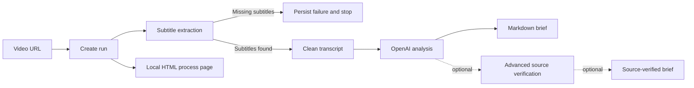

## adr_001_single_video_local_first_pipeline - Single Video Local First Pipeline
> Date: 2026-07-23
> Status: Proposed
> Drivers: single video URL input; mandatory subtitles; local-first operation; OpenAI analysis; optional source verification; VPS readiness
> Related request: `req_003_mvp_single_video_local_first_pipeline`
> Related backlog: `item_014_implement_single_video_run_model_and_url_input`, `item_015_make_subtitle_extraction_mandatory_and_add_transcript_cleanup`, `item_016_add_openai_llm_analysis_for_cleaned_transcripts`, `item_017_generate_direct_markdown_brief_from_llm_analysis`, `item_018_design_optional_advanced_source_verification_mode`, `item_019_build_local_html_process_page`, `item_020_add_end_to_end_local_mvp_validation`
> Related task: `task_004_orchestrate_single_video_local_first_mvp`
> Reminder: Update status, linked refs, decision rationale, consequences, and follow-up work when you edit this doc.

# Overview
ClaimLens will pivot from channel monitoring to a local-first, single-video workflow for the MVP.
The pipeline input is one YouTube video URL. Existing YouTube subtitles are mandatory. The base MVP
uses OpenAI to analyze cleaned transcript text and generate a Markdown brief, while source retrieval
and claim verdicts remain a disabled-by-default advanced mode.

# Context
- The previous architecture assumed channel ingestion, candidate selection, transcript creation,
  source retrieval, and brief generation as a linear batch-oriented path.
- User refinement removes channel ingestion and candidate selection from the base MVP.
- The repository already has a working subtitle extraction path and SQLite storage.
- The intended operational model is local-first now, with possible VPS hosting later.
- The system must prefer explicit failure over fallback behavior when subtitles are missing.
- Secrets, especially `OPENAI_API_KEY`, must not be persisted in durable artifacts.

# Decision
- Treat a single YouTube video URL as the base MVP input.
- Model pipeline progress as a local run with step status and failure cause.
- Make existing YouTube subtitles a hard prerequisite; do not download audio or transcribe audio in
  the base MVP.
- Store raw subtitle segments for traceability, but send only cleaned timestamp-free transcript text
  to the LLM step.
- Require OpenAI only for the analysis stage, behind a mockable client boundary.
- Generate a direct Markdown brief after LLM analysis and label it as not advanced-source-verified.
- Build a local HTML process page as the primary operator surface:
  - enter one video URL
  - provide an OpenAI key at run start
  - inspect step status and failure causes
  - launch the next eligible step
  - open generated outputs
- Keep host, port, database path, and output paths configurable so the same runtime can later be
  placed behind VPS-local infrastructure.
- Define `advanced_source_verification` as an optional extension point after analysis, not as a base
  MVP requirement.

# Pipeline Shape

# Data Boundaries
- Durable state belongs in SQLite and configured output directories.
- Raw transcript segments remain available for audit/debug.
- Cleaned transcript text is the canonical LLM input.
- OpenAI API keys are process/session inputs only.
- Generated briefs must disclose whether advanced source verification has run.

# Optional Advanced Source Verification
- Disabled by default for the MVP.
- Runs after LLM analysis, using extracted notable claims as inputs.
- Future adapters may include PubMed, Semantic Scholar, and curated web search.
- Verdicts should remain non-binary when evidence is mixed or insufficient:
  `supported`, `contradicted`, `mixed`, `unclear`, `not_checked`.
- Brief rendering must support both base and verified outputs without format churn.

# Consequences
- `ingest` and `candidates` are no longer base-MVP blockers.
- `run-daily` is deferred until the one-video flow is reliable.
- No-subtitle videos are expected failures, not bugs.
- The first useful UI is a process/control page, not a multi-user dashboard.
- Tests should mock YouTube and OpenAI boundaries; live smoke tests remain manual.
- VPS readiness requires configuration discipline now and authentication decisions later.

# Follow-up Work
- Implement single-video run state and URL parsing.
- Harden subtitle-unavailable failure handling.
- Add transcript cleanup and cleaned transcript storage/export.
- Add OpenAI analysis with a strict output contract.
- Add direct Markdown brief generation.
- Build the local HTML process page.
- Document advanced source verification interfaces before implementing live adapters.

# References
- Related request: `req_003_mvp_single_video_local_first_pipeline`
- Related product brief: `prod_004_claimlens_single_video_local_first_mvp`
- Related task: `task_004_orchestrate_single_video_local_first_mvp`
- Roadmap: `ROADMAP.md`
