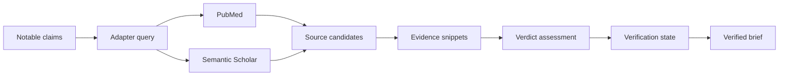

## adr_002_advanced_source_verification_architecture - Advanced Source Verification Architecture
> Date: 2026-07-23
> Status: Proposed
> Drivers: optional verification; PubMed and Semantic Scholar; health science claims; cited evidence snippets; non-binary verdicts; CLI and HTML controls; no secret persistence
> Related request: `req_004_advanced_source_verification_mode`
> Related backlog: `item_022_define_source_adapter_interfaces`
> Related task: `task_005_orchestrate_advanced_source_verification_mode`
> Reminder: Update status, linked refs, decision rationale, consequences, and follow-up work when you edit this doc.

# Overview
ClaimLens will add an optional health/science source verification mode after transcript analysis.
The mode retrieves candidate evidence from PubMed and Semantic Scholar, assesses stored notable
claims against cited evidence snippets, and renders source-verified briefs with non-binary verdicts.

# Context
- The base single-video MVP stores cleaned transcripts, OpenAI analysis, notable claims, and
  unverified Markdown briefs.
- Base briefs are currently labeled `not_advanced_source_verified`.
- The project already has `sources` and `claim_sources` tables, but no concrete verification run,
  evidence snippet, adapter, or assessment contracts.
- The first verification target is health/science content.
- PubMed and Semantic Scholar are the selected initial source systems.
- Broad web search is intentionally deferred because it is noisier and harder to validate safely.
- Verification output must support human review, not automated medical or scientific authority.
- Deterministic tests must mock PubMed, Semantic Scholar, and LLM assessment boundaries.

# Decision
- Keep `advanced_source_verification` disabled by default.
- Add source verification as an optional pipeline step after OpenAI transcript analysis.
- Verify only stored notable claims from the analysis step.
- Define one `SourceAdapter` contract for PubMed and Semantic Scholar:
  - input: claim text, optional health/science context, result limit, timeout
  - output: normalized source candidates with title, URL, publisher/source, publication date,
    abstract/snippet, adapter name, retrieval timestamp, and raw external identifiers
- Persist verification runs separately from base analysis so unverified and verified outputs remain
  distinguishable.
- Persist evidence snippets separately from source metadata:
  - claim reference
  - source reference
  - evidence polarity: `supports`, `contradicts`, or `context`
  - cited phrase/snippet
  - rationale or extraction note
- Use conservative non-binary verdicts:
  - `supported`
  - `contradicted`
  - `mixed`
  - `unclear`
  - `not_checked`
- Treat missing, weak, indirect, or adapter-failed evidence as `unclear` or `not_checked`, not as
  support.
- Render verified Markdown briefs as a variant of the existing brief renderer with:
  - visible source-verification status
  - verdict per checked claim
  - supporting evidence snippets
  - contradicting evidence snippets
  - citations/links to persisted sources
  - concise rationale
  - human-review disclaimer for health/science content
- Expose verification from both CLI and local HTML page.
- Keep API keys as runtime/config inputs only; do not persist secrets in SQLite, logs, transcripts,
  briefs, or HTML outputs.

# Consequences
- The base single-video MVP remains usable without source verification.
- The data model needs additive schema work for verification runs and evidence snippets.
- Brief generation must support both unverified and source-verified variants without breaking the
  existing Markdown output.
- The HTML page needs a new verification step state and output summary.
- Tests should focus on mockable boundaries and deterministic verdict cases rather than live API
  availability.
- Future source systems can plug into the same adapter contract after PubMed and Semantic Scholar.

# Follow-up Work
- Add optional CLI and HTML controls for verification activation.
- Define and test source adapter interfaces.
- Implement PubMed adapter.
- Implement Semantic Scholar adapter.
- Add verification/evidence persistence.
- Add conservative verdict assessment.
- Render source-verified Markdown briefs.
- Extend HTML process state and outputs.
- Document runtime keys, manual smoke tests, and human-review limits.

# References
- Related request: `req_004_advanced_source_verification_mode`
- Related backlog: `item_022_define_source_adapter_interfaces`
- Related task: `task_005_orchestrate_advanced_source_verification_mode`
