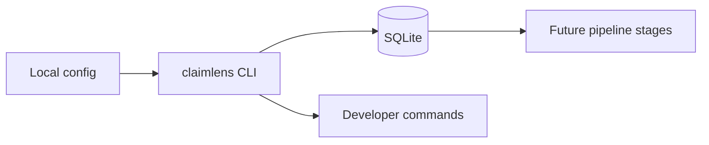

## prod_001_claimlens_local_skeleton - ClaimLens Local Skeleton
> Date: 2026-07-21
> Status: Proposed
> Related request: `req_000_milestone_1_local_skeleton`
> Related backlog: `item_001_create_python_package_and_cli_shell`, `item_002_implement_configuration_loading`, `item_003_create_sqlite_schema_and_init_db_command`, `item_004_add_baseline_test_and_quality_tooling`
> Related task: `task_001_orchestrate_milestone_1_local_skeleton`
> Related architecture: (none yet)
> Reminder: Update status, linked refs, scope, decisions, success signals, and open questions when you edit this doc.

# Overview
A minimal local foundation for the ClaimLens video-to-sourced-brief pipeline.

# Goals
- Make the project installable and runnable from the command line.
- Create the local database contract for future pipeline stages.
- Document the minimum environment and developer workflow.
- Keep all external API-dependent behavior outside the first implementation milestone.

# Non-goals
- Fetching real YouTube videos.
- Calling OpenAI APIs.
- Performing real source retrieval or evidence assessment.
- Building a web interface.
- Automating publishing.

# Scope and guardrails
- In: scaffolded request, product, backlog, orchestration task, validation, and handoff context.
- Out: unrelated workflow docs and implementation of generated tasks.

# Key product decisions
- Use structured input as the source of truth for generated docs.
- Keep generated write paths local and repo-bounded.

# Success signals
- Generated docs pass lint and audit without broad manual rewrites.
- Context-pack output can be handed to an implementation agent directly.

# References
- Product back-reference: `req_000_milestone_1_local_skeleton`
- Task back-reference: `task_001_orchestrate_milestone_1_local_skeleton`
