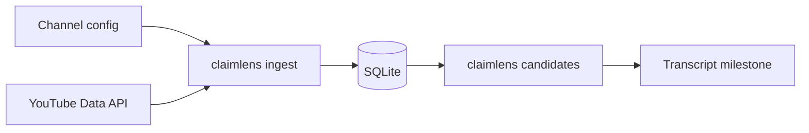

## prod_002_claimlens_metadata_ingestion - ClaimLens Metadata Ingestion
> Date: 2026-07-21
> Status: Superseded
> Related request: `req_001_milestone_2_metadata_ingestion`
> Related backlog: `item_005_load_channel_configuration_for_ingestion`, `item_006_create_bounded_youtube_metadata_client`, `item_007_persist_ingested_channels_and_videos`, `item_008_implement_ingest_and_candidates_cli_commands`, `item_009_add_ingestion_tests_and_documentation`
> Related task: `task_002_orchestrate_milestone_2_metadata_ingestion`
> Related architecture: (none yet)
> Reminder: Update status, linked refs, scope, decisions, success signals, and open questions when you edit this doc.

Superseded by: `prod_004_claimlens_single_video_local_first_mvp`.

This brief is retained for historical context only. The refined MVP no longer starts from channel
metadata ingestion or candidate selection.

# Overview
The first real pipeline stage for importing recent YouTube video metadata into the local ClaimLens database.

# Goals
- Turn the ingestion CLI placeholder into a working command.
- Keep channel configuration explicit and reviewable.
- Persist YouTube metadata in a way that can be reused by transcription, analysis, and brief generation.
- Provide a simple candidate listing workflow for manual selection.

# Non-goals
- Downloading audio or transcripts.
- Calling OpenAI APIs.
- Scoring videos with advanced ranking logic.
- Building a scheduler.
- Supporting every YouTube metadata field.

# Scope and guardrails
- In: channel config loading, bounded YouTube metadata ingestion, SQLite upserts, pipeline run records, candidates listing, tests, and README updates.
- Out: transcript download, OpenAI calls, advanced ranking, scheduling, publishing, and broad YouTube feature coverage.

# Key product decisions
- Keep YouTube access behind a mockable client boundary.
- Make the default test suite independent from network and API keys.
- Prefer a simple candidate list before adding scoring or approval workflows.

# Success signals
- `claimlens ingest` imports recent videos for configured channels when `YOUTUBE_API_KEY` is present.
- `claimlens candidates` lists ingested videos without requiring API keys.
- Re-running ingest is idempotent and records pipeline run status.
- Unit tests cover ingestion using mocked YouTube responses.

# References
- Product back-reference: `req_001_milestone_2_metadata_ingestion`
- Task back-reference: `task_002_orchestrate_milestone_2_metadata_ingestion`
