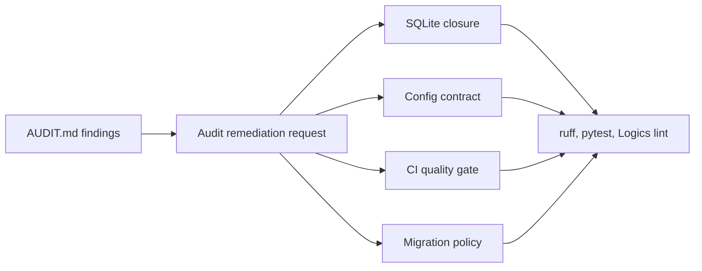

## prod_003_claimlens_audit_remediation_and_hardening - ClaimLens Audit Remediation and Hardening
> Date: 2026-07-23
> Status: Settled
> Related request: `req_002_audit_remediation_and_hardening`
> Related backlog: `item_010_close_sqlite_connections_deterministically`
> Related task: `task_003_orchestrate_audit_remediation_and_hardening`
> Related architecture: (none yet)
> Reminder: Update status, linked refs, scope, decisions, success signals, and open questions when you edit this doc.

# Overview
A focused hardening pass that converts audit findings into verified reliability, configuration, CI, and schema-governance improvements.

# Goals
- Address the actionable audit findings without disrupting the Milestone 2 ingestion chain.
- Reduce local runtime reliability risk in database helpers.
- Clarify configuration contracts for installed and repository-local usage.
- Make routine quality validation automatic in CI.
- Record migration expectations before schema evolution becomes risky.

# Non-goals
- Implementing YouTube metadata ingestion.
- Adding transcript, analysis, or brief-generation behavior.
- Introducing a full migration framework before a schema change needs it.
- Adding live API integration tests.
- Changing repository release or deployment strategy.

# Scope and guardrails
- In: scaffolded request, product, backlog, orchestration task, validation, and handoff context.
- Out: unrelated workflow docs and implementation of generated tasks.

# Key product decisions
- Use structured input as the source of truth for generated docs.
- Keep generated write paths local and repo-bounded.

# Success signals
- Generated docs pass lint and audit without broad manual rewrites.
- Context-pack output can be handed to an implementation agent directly.

# References
- Product back-reference: `item_010_close_sqlite_connections_deterministically`
- Task back-reference: `task_003_orchestrate_audit_remediation_and_hardening`
