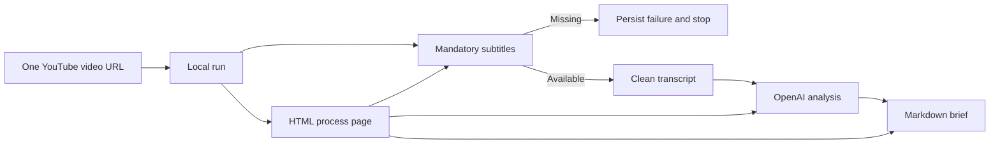

## prod_004_claimlens_single_video_local_first_mvp - ClaimLens Single Video Local First MVP
> Date: 2026-07-23
> Status: Proposed
> Related request: `req_003_mvp_single_video_local_first_pipeline`
> Related backlog: `item_014_implement_single_video_run_model_and_url_input`, `item_015_make_subtitle_extraction_mandatory_and_add_transcript_cleanup`, `item_016_add_openai_llm_analysis_for_cleaned_transcripts`, `item_017_generate_direct_markdown_brief_from_llm_analysis`, `item_018_design_optional_advanced_source_verification_mode`, `item_019_build_local_html_process_page`, `item_020_add_end_to_end_local_mvp_validation`
> Related task: `task_004_orchestrate_single_video_local_first_mvp`
> Related architecture: `adr_001_single_video_local_first_pipeline`
> Reminder: Update status, linked refs, scope, decisions, success signals, and open questions when you edit this doc.

# Overview
A local-first workflow that turns one YouTube video URL with available subtitles into a reviewable LLM-generated brief, with clear step-by-step status and failure handling.

# Goals
- Reduce MVP input to a single YouTube video URL.
- Make subtitles mandatory and fail clearly when they are missing.
- Clean transcript text before analysis while retaining raw transcript data for auditability.
- Use an OpenAI API key entered at run start for the LLM analysis path.
- Generate a Markdown brief directly from LLM analysis before advanced source verification exists.
- Expose a local HTML process page for running and inspecting each pipeline step.
- Keep the design local-first and ready for later VPS hosting.

# Non-goals
- Monitoring channels or ingesting batches of videos.
- Candidate scoring and ranking.
- Audio download or OpenAI audio transcription fallback when captions are unavailable.
- Automatic publication to a CMS.
- Mandatory advanced source retrieval or evidence verdicts in the base MVP.
- Persisting OpenAI API keys in SQLite, generated briefs, or logs.

# Scope and guardrails
- In: single video URL input, mandatory subtitle extraction, transcript cleanup, OpenAI analysis,
  direct Markdown brief generation, local HTML process page, failure visibility, and local-first/VPS-
  ready configuration.
- Out: channel monitoring, candidate ranking, batch ingestion, audio transcription fallback,
  mandatory source retrieval, mandatory evidence verdicts, scheduler automation, CMS publishing, and
  multi-user hosted auth.

# Key product decisions
- The MVP starts from one YouTube video URL, not a channel or backlog of candidates.
- Subtitles are required. A video without captions is a valid stopped run with an explanatory
  failure state.
- Transcript cleanup is part of the pipeline because the LLM should receive timestamp-free,
  normalized text.
- OpenAI analysis is required for the base MVP, but the API key must be supplied at run start and
  never persisted.
- The base MVP generates a brief directly after analysis and clearly labels it as not
  advanced-source-verified.
- Advanced source verification is designed as an optional mode, disabled by default.
- The HTML process page is an operator surface for one run, not a marketing landing page or a
  multi-user dashboard.

# Success signals
- A user can enter a single YouTube URL and OpenAI key, then create a local run.
- The user can see whether subtitle extraction succeeded or why it stopped.
- The cleaned transcript is available without timestamps and raw segments remain auditable.
- The user can launch OpenAI analysis and brief generation from the CLI or HTML process page.
- A generated Markdown brief exists and states the source-verification status.
- The local HTML page shows step statuses, failure causes, output links, and next eligible actions.
- Deterministic tests cover the pipeline boundaries without live YouTube or OpenAI calls.
- The workflow can later move behind a VPS-local host/port configuration without rewriting storage
  or pipeline contracts.

# References
- Product back-reference: `req_003_mvp_single_video_local_first_pipeline`
- Task back-reference: `task_004_orchestrate_single_video_local_first_mvp`
- Architecture back-reference: `adr_001_single_video_local_first_pipeline`
