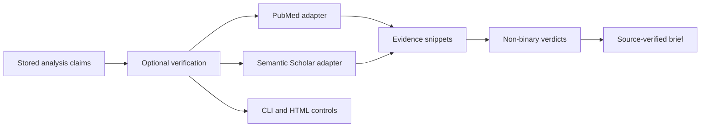

## prod_005_claimlens_advanced_source_verification_mode - ClaimLens Advanced Source Verification Mode
> Date: 2026-07-23
> Status: Settled
> Related request: `req_004_advanced_source_verification_mode`
> Related backlog: `item_021_add_optional_verification_mode_controls`
> Related task: `task_005_orchestrate_advanced_source_verification_mode`
> Related architecture: (none yet)
> Reminder: Update status, linked refs, scope, decisions, success signals, and open questions when you edit this doc.

# Overview
An optional health/science verification workflow that enriches ClaimLens briefs with cited PubMed and Semantic Scholar evidence, non-binary verdicts, and reviewer-facing rationale.

# Goals
- Let a reviewer run source verification after the existing transcript analysis step.
- Prioritize health and science sources through PubMed and Semantic Scholar.
- Show evidence that supports and evidence that contradicts each notable claim when available.
- Use non-binary verdicts that handle mixed, unclear, and unchecked evidence honestly.
- Generate Markdown briefs that distinguish base analysis from source-verified review output.
- Expose the verification workflow in both CLI and local HTML surfaces.
- Keep verification disabled by default so the base single-video MVP remains fast and simple.

# Non-goals
- Broad web search in the first verification implementation.
- Final medical advice, clinical recommendation, diagnosis, or regulatory determination.
- Guaranteeing scientific truth or replacing human review.
- Live-network tests in the deterministic test suite.
- Batch verification across many videos.
- Persisting PubMed, Semantic Scholar, OpenAI, or other API keys in SQLite, logs, or generated briefs.

# Scope and guardrails
- In: optional verification activation, PubMed and Semantic Scholar retrieval, normalized source
  candidates, persisted evidence snippets, non-binary verdicts, source-verified Markdown briefs,
  and CLI plus local HTML controls.
- Out: broad web search, final medical advice, automated clinical recommendations, hosted
  multi-user workflow, batch verification, and live-network tests in the deterministic suite.
- Guardrail: every verified output must make clear that evidence review is advisory and requires
  human judgment for health/science claims.
- Guardrail: runtime API keys must not be persisted in SQLite, logs, generated transcripts, briefs,
  or HTML outputs.

# Key product decisions
- Verification is optional and disabled by default.
- PubMed and Semantic Scholar are the first supported sources.
- Broad web search is deferred.
- Only stored notable claims from transcript analysis are verified.
- Verdicts are non-binary: supported, contradicted, mixed, unclear, or not_checked.
- Source-verified briefs include citations plus supporting and contradicting snippets when
  available.
- CLI and local HTML page both support launching and inspecting verification.

# Success signals
- A reviewer can run verification after analysis without changing the base unverified workflow.
- Retrieved PubMed and Semantic Scholar candidates are stored with auditable metadata.
- Each checked claim has a verdict, rationale, and cited evidence snippets where available.
- Verified Markdown briefs visibly differ from base briefs and include source-verification status.
- The local HTML page shows verification status, failures, source counts, verdict summaries, and
  output links.
- Deterministic tests cover adapters, persistence, assessment, rendering, and HTML state without
  live network calls.

# References
- Product back-reference: `item_021_add_optional_verification_mode_controls`
- Task back-reference: `task_005_orchestrate_advanced_source_verification_mode`
