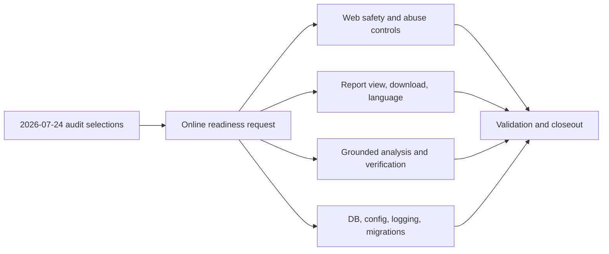

## prod_006_claimlens_online_readiness_audit_implementation - ClaimLens Online Readiness Audit Implementation
> Date: 2026-07-24
> Status: Settled
> Related request: `req_005_online_readiness_audit_implementation`
> Related backlog: `item_030_harden_web_mutation_safety_controls`
> Related task: `task_006_orchestrate_online_readiness_audit_implementation`
> Related architecture: (none yet)
> Reminder: Update status, linked refs, scope, decisions, success signals, and open questions when you edit this doc.

# Overview
A focused implementation program that converts the accepted pre-deployment audit findings into guarded web operation, report delivery, stronger evidence handling, and production robustness.

# Goals
- Make the existing local process page safer and more usable for future guarded online access.
- Deliver in-browser final report viewing and Markdown download.
- Improve transcript analysis determinism, grounding, and cost bounds.
- Make source verification evidence handling more honest, inspectable, and failure-aware.
- Harden SQLite, configuration, logging, migration policy, and abuse controls for online operation.

# Non-goals
- Do not decide or implement the OpenAI key ownership model in this chain; keep B1 in standby.
- Do not implement HTTPS, login, reverse-proxy, or hosting deployment in this chain; keep B2 in standby.
- Do not add new prominence work for the human-review disclaimer beyond preserving current disclaimer behavior.
- Do not build a full multi-user SaaS account system unless required by the selected rate-limiting or quota implementation.
- Do not add live external API tests to CI.

# Scope and guardrails
- In: scaffolded request, product, backlog, orchestration task, validation, and handoff context.
- Out: unrelated workflow docs and implementation of generated tasks.

# Key product decisions
- Use structured input as the source of truth for generated docs.
- Keep generated write paths local and repo-bounded.

# Success signals
- Generated docs pass lint and audit without broad manual rewrites.
- Context-pack output can be handed to an implementation agent directly.

# References
- Product back-reference: `item_030_harden_web_mutation_safety_controls`
- Task back-reference: `task_006_orchestrate_online_readiness_audit_implementation`
