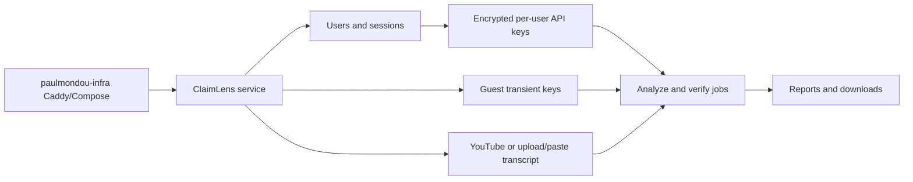

## prod_007_claimlens_deployable_web_auth_and_api_key_management - ClaimLens Deployable Web Auth And API Key Management
> Date: 2026-07-24
> Status: Settled
> Related request: `req_006_deployable_web_auth_and_api_key_management`
> Related backlog: `item_041_package_claimlens_for_container_deployment`
> Related task: `task_007_orchestrate_deployable_web_auth_and_api_key_management`
> Related architecture: (none yet)
> Reminder: Update status, linked refs, scope, decisions, success signals, and open questions when you edit this doc.

# Overview
A deployment-readiness slice that turns ClaimLens from a guarded local process page into a self-hostable web app with login, secure per-user API key storage, guest operation, and VPS/Caddy integration guidance.

# Goals
- Make ClaimLens deployable as its own service in the existing paulmondou-infra VPS stack.
- Allow authenticated users to save API keys securely and reuse them across runs.
- Preserve guest usage without persistent secrets.
- Keep PubMed and Semantic Scholar usable without keys while supporting optional saved keys.
- Add the navigation and options UI needed for a real web workflow.
- Avoid a VPS transcript dead end by adding a user-facing transcript fallback.

# Non-goals
- Do not deploy to the VPS automatically as part of this request; produce a deployable app and infra-ready instructions first.
- Do not implement payments, billing, public self-service SaaS onboarding, or multi-tenant administration.
- Do not store API keys in plaintext or in reversible form without an external deployment secret.
- Do not require PubMed or Semantic Scholar API keys for baseline source verification.
- Do not solve YouTube IP blocking with proxy rotation in this request.

# Scope and guardrails
- In: scaffolded request, product, backlog, orchestration task, validation, and handoff context.
- Out: unrelated workflow docs and implementation of generated tasks.

# Key product decisions
- Use structured input as the source of truth for generated docs.
- Keep generated write paths local and repo-bounded.

# Success signals
- Generated docs pass lint and audit without broad manual rewrites.
- Context-pack output can be handed to an implementation agent directly.

# References
- Product back-reference: `item_041_package_claimlens_for_container_deployment`
- Task back-reference: `task_007_orchestrate_deployable_web_auth_and_api_key_management`
