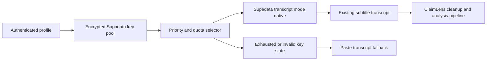

## prod_008_claimlens_supadata_native_transcript_key_rotation - ClaimLens Supadata Native Transcript Key Rotation
> Date: 2026-07-24
> Status: Settled
> Related request: `req_007_supadata_native_transcript_key_rotation`
> Related backlog: `item_049_implement_supadata_native_transcript_client`
> Related task: `task_008_orchestrate_supadata_native_transcript_key_rotation`
> Related architecture: (none yet)
> Reminder: Update status, linked refs, scope, decisions, success signals, and open questions when you edit this doc.

# Overview
A transcript-acquisition upgrade that lets ClaimLens use Supadata native captions with multiple encrypted profile keys and deterministic quota rotation while preventing AI-generated transcript spend.

# Goals
- Improve deployed transcript reliability by adding Supadata as a managed transcript source.
- Keep Supadata usage cost-controlled by forcing native subtitle extraction only.
- Let a profile store several Supadata keys and rotate through them when free monthly quota is consumed.
- Preserve existing encrypted key handling and access-control guarantees.
- Keep the pasted transcript fallback as the final path when native captions or quota are unavailable.

# Non-goals
- Do not use Supadata auto mode, generate mode, translation, extract, file transcription, or any AI fallback path in this request.
- Do not implement billing, payments, account sharing, or public multi-tenant quota administration.
- Do not bypass Supadata plan limits or retry indefinitely after quota exhaustion.
- Do not remove the existing local YouTube transcript extraction path.
- Do not store API keys in plaintext or expose full key values in the UI.

# Scope and guardrails
- In: scaffolded request, product, backlog, orchestration task, validation, and handoff context.
- Out: unrelated workflow docs and implementation of generated tasks.

# Key product decisions
- Use structured input as the source of truth for generated docs.
- Keep generated write paths local and repo-bounded.

# Success signals
- Generated docs pass lint and audit without broad manual rewrites.
- Context-pack output can be handed to an implementation agent directly.

# References
- Product back-reference: `item_049_implement_supadata_native_transcript_client`
- Task back-reference: `task_008_orchestrate_supadata_native_transcript_key_rotation`
