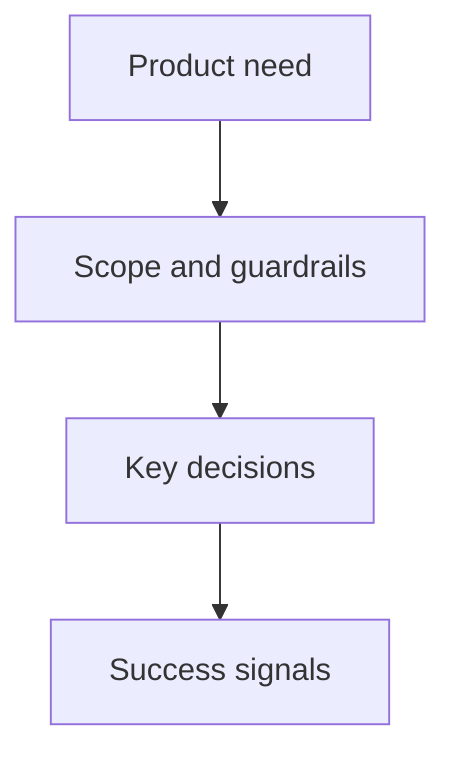

## prod_010_remove_supadata_fetch_preflight_latency - Remove Supadata fetch preflight latency
> Date: 2026-07-24
> Status: Proposed
> Related request: `req_008_supadata_first_provider_order_fix`
> Related backlog: `item_055_remove_supadata_fetch_preflight_latency`
> Related task: (none yet)
> Related architecture: (none yet)
> Reminder: Update status, linked refs, scope, decisions, success signals, and open questions when you edit this doc.

# Overview
Logics should keep a single, predictable product surface for remove supadata fetch preflight latency.

# Goals
- Keep the operator experience bounded and easy to reason about.
- Preserve the CLI as the canonical workflow entrypoint.

# Non-goals
- Rebuilding the VS Code plugin UI in this document.
- Adding a remote runtime boundary.

# Scope and guardrails
- In: user-facing workflow shape, CLI contract, and migration boundaries.
- Out: unrelated UI redesign or cloud-hosted orchestration.

# Key product decisions
- Keep the runtime integrated and local.
- Keep assistant-facing instructions derived from the runtime.

# Success signals
- The change can be used without extra manual setup.
- The product can be explained from a single reference surface.

# References
- Product back-reference: `item_055_remove_supadata_fetch_preflight_latency`
- Task back-reference: (none yet)
