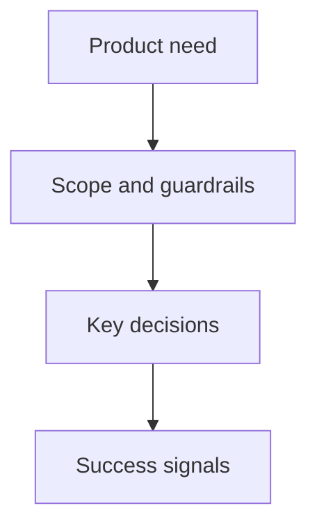

## prod_012_claimlens_supadata_first_transcript_deployment - ClaimLens Supadata-first transcript deployment
> Date: 2026-07-24
> Status: Superseded
> Related request: `req_008_supadata_first_provider_order_fix`
> Related backlog: (none yet)
> Related task: (none yet)
> Related architecture: (none yet)
> Reminder: Update status, linked refs, scope, decisions, success signals, and open questions when you edit this doc.

# Overview
Superseded by the per-slice product briefs created with the delivery chain: `prod_009_configure_supadata_first_deployment`, `prod_010_remove_supadata_fetch_preflight_latency`, and `prod_011_validate_supadata_first_fallback_delivery`.

# References
- Superseded by: `prod_009_configure_supadata_first_deployment`, `prod_010_remove_supadata_fetch_preflight_latency`, `prod_011_validate_supadata_first_fallback_delivery`
- Task back-reference: (none yet)
