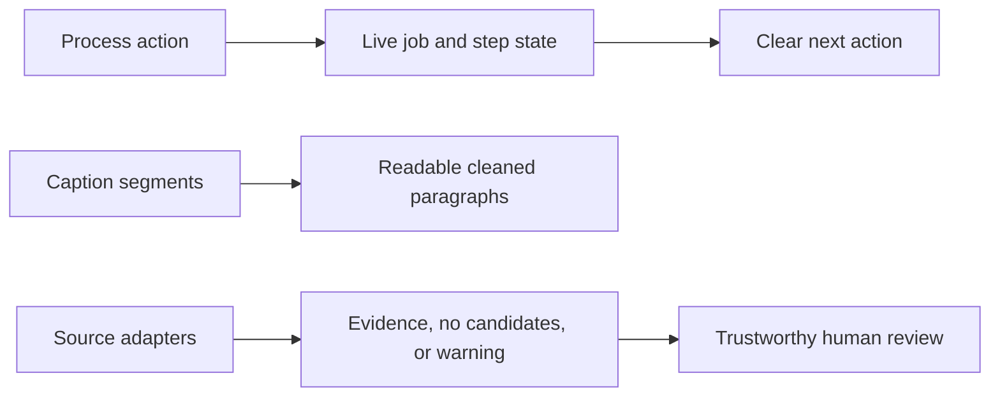

## prod_013_live_claimlens_process_feedback_and_trustworthy_verification_results - Live ClaimLens process feedback and trustworthy verification results
> Date: 2026-07-24
> Status: Settled
> Related request: `req_009_make_process_state_live_and_verification_outcomes_actionable`
> Related backlog: `item_057_add_bounded_live_process_job_state_refresh`
> Related task: `task_010_orchestrate_live_process_feedback_and_verification_reliability_delivery`
> Related architecture: (none yet)
> Reminder: Update status, linked refs, scope, decisions, success signals, and open questions when you edit this doc.

# Overview
Operators need the Process page to reflect work already completed in the background and to understand whether verification found evidence, found nothing, or could not complete because a source adapter was limited.

# Goals
- Make process actions feel complete without manual page refreshes.
- Remove irrelevant credential prompts for signed-in users while preserving BYO-key guest workflows.
- Produce readable transcript artifacts for analysis and review.
- Make verification limits and evidence gaps visible enough for informed human review.

# Non-goals
- Move jobs to an external queue or introduce a realtime messaging service.
- Store or display plaintext API keys.
- Alter raw transcript timing data or enable generated/translated captions.
- Claim scientific validation when no usable evidence was retrieved.

# Scope and guardrails
- In: scaffolded request, product, backlog, orchestration task, validation, and handoff context.
- Out: unrelated workflow docs and implementation of generated tasks.

# Key product decisions
- Use structured input as the source of truth for generated docs.
- Keep generated write paths local and repo-bounded.

# Success signals
- Generated docs pass lint and audit without broad manual rewrites.
- Context-pack output can be handed to an implementation agent directly.

# References
- Product back-reference: `item_057_add_bounded_live_process_job_state_refresh`
- Task back-reference: `task_010_orchestrate_live_process_feedback_and_verification_reliability_delivery`
