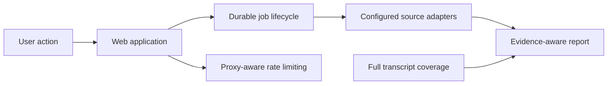

## prod_014_reliable_claimlens_jobs_and_evidence_aware_reports - Reliable ClaimLens jobs and evidence-aware reports
> Date: 2026-07-24
> Status: Settled
> Related request: `req_010_harden_claimlens_production_reliability_and_verification_integrity`
> Related backlog: `item_062_recover_durable_jobs_after_process_restart`
> Related task: `task_011_orchestrate_production_reliability_and_verification_integrity_hardening`
> Related architecture: (none yet)
> Reminder: Update status, linked refs, scope, decisions, success signals, and open questions when you edit this doc.

# Overview
ClaimLens needs to remain correct when workers restart, traffic passes through its documented proxy, and scholarly providers are limited. Its reports must distinguish retrieved evidence from an incomplete verification attempt and disclose the coverage of the analysis.

# Overview Diagram

# Goals
- Prevent abandoned asynchronous work from blocking user workflows.
- Protect provider quotas and make rate limits understandable and recoverable.
- Make configuration flags operational rather than declarative.
- Improve the truthfulness, relevance, and coverage transparency of verification reports.
- Establish end-to-end regression coverage for production-critical workflows.

# Non-goals
- Introduce an unbounded background worker fleet or a paid queue service without a deployment decision.
- Claim clinical or scientific certainty from retrieved literature candidates.
- Enable untrusted forwarded headers or remove existing authorization checks.
- Run live third-party provider calls in the automated test suite.

# Scope and guardrails
- In: scaffolded request, product, backlog, orchestration task, validation, and handoff context.
- Out: unrelated workflow docs and implementation of generated tasks.

# Key product decisions
- Use structured input as the source of truth for generated docs.
- Keep generated write paths local and repo-bounded.

# Success signals
- Generated docs pass lint and audit without broad manual rewrites.
- Context-pack output can be handed to an implementation agent directly.

# References
- Product back-reference: `item_062_recover_durable_jobs_after_process_restart`
- Task back-reference: `task_011_orchestrate_production_reliability_and_verification_integrity_hardening`
