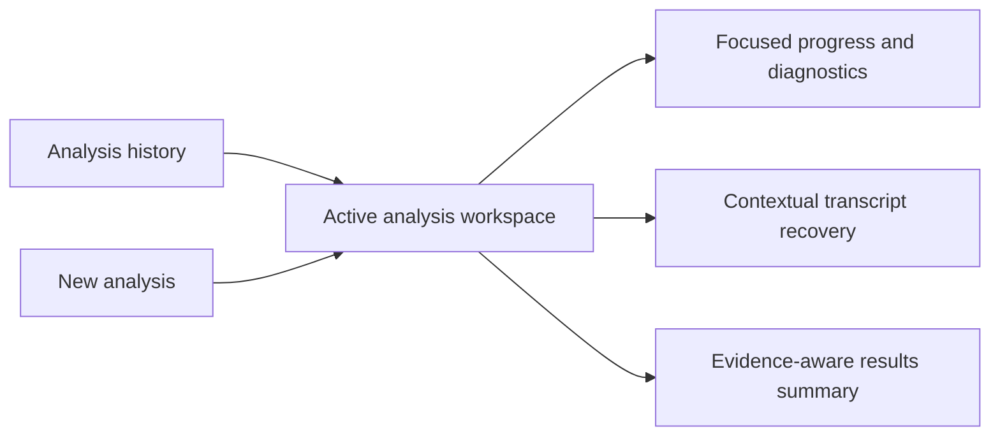

## prod_015_focused_english_language_claimlens_analysis_workspace - Focused English-language ClaimLens analysis workspace
> Date: 2026-07-24
> Status: Settled
> Related request: `req_011_refine_the_claimlens_analysis_workspace_user_experience`
> Related backlog: `item_068_create_a_focused_active_analysis_workspace`
> Related task: `task_012_orchestrate_the_claimlens_analysis_workspace_ux_refinement`
> Related architecture: (none yet)
> Reminder: Update status, linked refs, scope, decisions, success signals, and open questions when you edit this doc.

# Overview
The analysis interface should behave like a focused operational workspace: users immediately understand the active video's state, the next meaningful action, whether evidence was found, and where to return to previous work.

# Overview Diagram

# Goals
- Make the active analysis the visual and interaction priority.
- Reduce scanning and duplicate status interpretation.
- Make exceptional recovery paths feel deliberate rather than permanently exposed.
- Make evidence limitations understandable before a report is opened.
- Keep the product fully English and accessible across desktop and mobile.

# Non-goals
- Change the analysis, transcript, or verification domain logic.
- Introduce internationalization, locale selection, or non-English UI copy.
- Replace the existing lightweight server with a frontend framework.
- Build a marketing landing page.

# Scope and guardrails
- In: scaffolded request, product, backlog, orchestration task, validation, and handoff context.
- Out: unrelated workflow docs and implementation of generated tasks.

# Key product decisions
- Use structured input as the source of truth for generated docs.
- Keep generated write paths local and repo-bounded.

# Success signals
- Generated docs pass lint and audit without broad manual rewrites.
- Context-pack output can be handed to an implementation agent directly.

# References
- Product back-reference: `item_068_create_a_focused_active_analysis_workspace`
- Task back-reference: `task_012_orchestrate_the_claimlens_analysis_workspace_ux_refinement`
