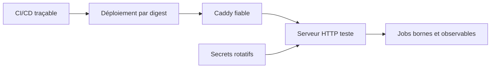

## prod_017_hardening_de_production_claimlens_suivi - Hardening de production ClaimLens - suivi
> Date: 2026-07-30
> Status: Settled
> Related request: `req_013_finaliser_le_hardening_web_et_operationnel_de_claimlens`
> Related backlog: `item_077_fiabiliser_l_identite_client_derriere_le_reverse_proxy_et_tester_le_serveur_http`
> Related task: `task_017_orchestrer_le_suivi_de_hardening_web_et_operationnel_claimlens`
> Related architecture: (none yet)
> Reminder: Update status, linked refs, scope, decisions, success signals, and open questions when you edit this doc.

# Overview
Finaliser les controles de frontiere web, la preuve d'integration, l'exploitation des jobs, la rotation des secrets et la supply chain sans modifier le moteur de verification scientifique.

# Goals
- Prevenir le contournement des protections anti-abus exposees par le reverse proxy.
- Rendre les comportements web critiques reproductibles et testes depuis HTTP.
- Donner une capacite operationnelle explicite et observable aux jobs.
- Rendre les secrets rotatifs et la livraison conteneurisee verifiable.

# Non-goals
- Changer la polarite scientifique, les verdicts ou les libelles source-verified.
- Migrer immediatement vers une file de jobs externe ou une architecture multi-replica.
- Ajouter de nouveaux fournisseurs de sources ou de transcription.

# Scope and guardrails
- In: scaffolded request, product, backlog, orchestration task, validation, and handoff context.
- Out: unrelated workflow docs and implementation of generated tasks.

# Key product decisions
- Use structured input as the source of truth for generated docs.
- Keep generated write paths local and repo-bounded.

# Success signals
- Generated docs pass lint and audit without broad manual rewrites.
- Context-pack output can be handed to an implementation agent directly.

# References
- Product back-reference: `item_077_fiabiliser_l_identite_client_derriere_le_reverse_proxy_et_tester_le_serveur_http`
- Task back-reference: `task_017_orchestrer_le_suivi_de_hardening_web_et_operationnel_claimlens`
