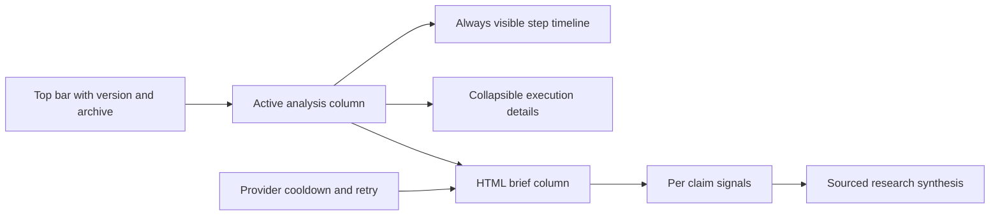

## prod_018_espace_d_analyse_et_brief_scientifique_orientes_lecture - Espace d'analyse et brief scientifique orientés lecture
> Date: 2026-08-02
> Status: Settled
> Related request: `req_014_rendre_l_analyse_claimlens_lisible_scientifique_et_fiable_en_production`
> Related backlog: `item_081_rendre_l_etat_de_l_analyse_continu_et_exact_apres_rafraichissement`
> Related task: `task_018_orchestrer_la_lisibilite_et_la_fiabilite_du_brief_claimlens`
> Related architecture: (none yet)
> Reminder: Update status, linked refs, scope, decisions, success signals, and open questions when you edit this doc.

# Overview
Faire de ClaimLens une vue d'analyse à deux colonnes, immédiatement lisible et fiable, qui transforme les sources proches en explications scientifiques utiles.

# Overview Diagram

# Goals
- Donner une lecture continue de l'avancement réel sans exposer les diagnostics par défaut.
- Mettre le brief final et les conclusions scientifiques au centre de la décision utilisateur.
- Épuiser proprement les limites temporaires des fournisseurs avant de les présenter comme des échecs.

# Non-goals
- Modifier la politique éditoriale de prudence, ni présenter le brief comme un avis médical ou clinique.
- Changer la clé de production Semantic Scholar ou les autres fournisseurs de recherche hors stratégie commune de retry.
- Ajouter une application frontend ou un système de traduction complet.

# Scope and guardrails
- In: scaffolded request, product, backlog, orchestration task, validation, and handoff context.
- Out: unrelated workflow docs and implementation of generated tasks.

# Key product decisions
- Use structured input as the source of truth for generated docs.
- Keep generated write paths local and repo-bounded.

# Success signals
- Generated docs pass lint and audit without broad manual rewrites.
- Context-pack output can be handed to an implementation agent directly.

# References
- Product back-reference: `item_081_rendre_l_etat_de_l_analyse_continu_et_exact_apres_rafraichissement`
- Task back-reference: `task_018_orchestrer_la_lisibilite_et_la_fiabilite_du_brief_claimlens`
