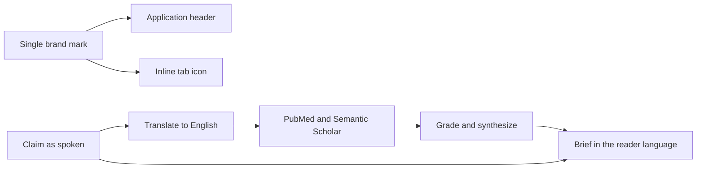

## prod_019_marque_claimlens_et_recherche_scientifique_independante_de_la_langue - Marque ClaimLens et recherche scientifique independante de la langue
> Date: 2026-08-03
> Status: Settled
> Related request: `req_015_donner_a_claimlens_sa_marque_propre_et_une_recherche_scientifique_independante_de_la_langue`
> Related backlog: `item_085_adopter_la_marque_claimlens_dans_l_en_tete_et_dans_l_onglet`
> Related task: `task_019_livrer_la_marque_claimlens_et_la_recherche_scientifique_multilingue`
> Related architecture: (none yet)
> Reminder: Update status, linked refs, scope, decisions, success signals, and open questions when you edit this doc.

# Overview
Rendre ClaimLens identifiable d'un coup d'œil et faire en sorte qu'une vidéo non anglophone obtienne les mêmes preuves scientifiques qu'une vidéo anglophone.

# Overview Diagram

# Goals
- Donner à l'application une marque cohérente entre l'onglet, l'en-tête et le site hôte.
- Poser la traduction des claims comme une étape normale de la recherche, invisible pour le lecteur.
- Garder la langue du lecteur pour tout ce qu'il lit, et l'anglais pour tout ce qui interroge la littérature.

# Non-goals
- Traduire l'interface ou introduire un système d'internationalisation complet.
- Traduire le brief, les sources ou les titres d'articles récupérés.
- Refondre l'identité visuelle au-delà de la marque et de l'icône d'onglet.

# Scope and guardrails
- In: scaffolded request, product, backlog, orchestration task, validation, and handoff context.
- Out: unrelated workflow docs and implementation of generated tasks.

# Key product decisions
- Use structured input as the source of truth for generated docs.
- Keep generated write paths local and repo-bounded.

# Success signals
- Generated docs pass lint and audit without broad manual rewrites.
- Context-pack output can be handed to an implementation agent directly.

# References
- Product back-reference: `item_085_adopter_la_marque_claimlens_dans_l_en_tete_et_dans_l_onglet`
- Task back-reference: `task_019_livrer_la_marque_claimlens_et_la_recherche_scientifique_multilingue`
