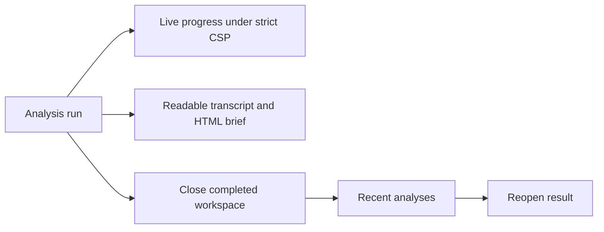

## prod_020_espace_d_analyse_termine_reouvrable_et_lisible - Espace d'analyse terminé, réouvrable et lisible
> Date: 2026-08-03
> Status: Settled
> Related request: `req_016_finaliser_l_espace_d_analyse_claimlens_et_ses_livrables_lisibles`
> Related backlog: `item_087_rendre_le_suivi_d_analyse_compatible_csp_et_observable`
> Related task: `task_020_orchestrer_la_finalisation_de_l_espace_d_analyse_claimlens`
> Related architecture: (none yet)
> Reminder: Update status, linked refs, scope, decisions, success signals, and open questions when you edit this doc.

# Overview
Un espace ClaimLens fiable où l'avancement est vivant, les résultats terminés ne monopolisent pas l'écran et les livrables sont consultables sans outil technique.

# Overview Diagram

# Goals
- Conserver une CSP stricte tout en assurant la mise à jour en direct.
- Réduire l'encombrement de l'écran une fois une analyse terminée sans perdre l'accès à ses preuves.
- Remplacer les chemins techniques et le Markdown comme seules sorties par des interactions sûres et lisibles.
- Simplifier le lancement de l'analyse autour des choix réellement nécessaires.

# Non-goals
- Ne pas ouvrir le gestionnaire de fichiers ou un dossier du serveur depuis le navigateur.
- Ne pas ajouter de traduction ou de choix de langue utilisateur à la place du champ supprimé.
- Ne pas remplacer SQLite ou le moteur de traitement asynchrone dans cette livraison.

# Scope and guardrails
- In: scaffolded request, product, backlog, orchestration task, validation, and handoff context.
- Out: unrelated workflow docs and implementation of generated tasks.

# Key product decisions
- Use structured input as the source of truth for generated docs.
- Keep generated write paths local and repo-bounded.

# Success signals
- Generated docs pass lint and audit without broad manual rewrites.
- Context-pack output can be handed to an implementation agent directly.

# References
- Product back-reference: `item_087_rendre_le_suivi_d_analyse_compatible_csp_et_observable`
- Task back-reference: `task_020_orchestrer_la_finalisation_de_l_espace_d_analyse_claimlens`
