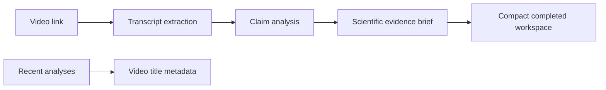

## prod_021_claimlens_analysis_interface_polish - ClaimLens analysis interface polish
> Date: 2026-08-03
> Status: Settled
> Related request: `req_017_polish_the_claimlens_analysis_interface_and_completed_run_reading_view`
> Related backlog: `item_091_refine_analysis_labels_history_metadata_and_completed_workspace_density`
> Related task: `task_021_deliver_the_claimlens_analysis_interface_polish`
> Related architecture: (none yet)
> Reminder: Update status, linked refs, scope, decisions, success signals, and open questions when you edit this doc.

# Overview
Make the analysis workspace clearer during review, while preserving evidence and transcript access.

# Goals
- Improve page labels and explanatory copy.
- Prioritize the completed brief over execution mechanics.
- Improve history scanability with the video title.
- Increase the visual presence of the existing brand mark.

# Non-goals
- Change the analysis pipeline or scientific-review logic.
- Delete or migrate existing analysis records.
- Change the dimensions or colours of the brand tile.

# Scope and guardrails
- In: scaffolded request, product, backlog, orchestration task, validation, and handoff context.
- Out: unrelated workflow docs and implementation of generated tasks.

# Key product decisions
- Use structured input as the source of truth for generated docs.
- Keep generated write paths local and repo-bounded.

# Success signals
- Generated docs pass lint and audit without broad manual rewrites.
- Context-pack output can be handed to an implementation agent directly.

# References
- Product back-reference: `item_091_refine_analysis_labels_history_metadata_and_completed_workspace_density`
- Task back-reference: `task_021_deliver_the_claimlens_analysis_interface_polish`
