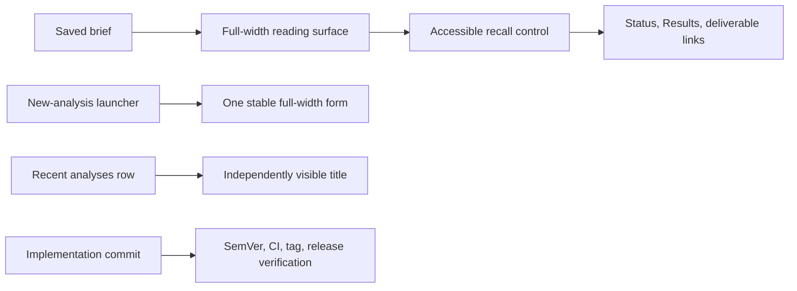

## prod_022_brief_first_analysis_workspace_and_repeatable_release_delivery - Brief-first analysis workspace and repeatable release delivery
> Date: 2026-08-03
> Status: Settled
> Related request: `req_018_prioritise_the_completed_analysis_brief_and_standardise_claimlens_delivery_releases`
> Related backlog: `item_093_make_the_completed_brief_full_page_and_recall_completed_analysis_details`
> Related task: `task_022_deliver_the_brief_first_analysis_workspace_and_validated_release`
> Related architecture: (none yet)
> Reminder: Update status, linked refs, scope, decisions, success signals, and open questions when you edit this doc.

# Overview
Let a finished scientific brief own the analysis page while retaining all completed-run details on demand, repair the consistent launcher and history scanability, and make the release handoff repeatable.

# Goals
- Turn the completed analysis screen into a reading-first experience.
- Preserve transparent access to completed results and terminal states.
- Eliminate the inconsistent new-analysis layout.
- Make history useful at a glance through a visible title.
- Make every functional delivery follow an auditable release sequence.

# Non-goals
- Change the transcript, claim-extraction, or evidence-verification pipeline.
- Delete completed analyses or hide their data permanently.
- Introduce a new database migration when the existing video title data is available.
- Tag or release an unvalidated commit.

# Scope and guardrails
- In: scaffolded request, product, backlog, orchestration task, validation, and handoff context.
- Out: unrelated workflow docs and implementation of generated tasks.

# Key product decisions
- Use structured input as the source of truth for generated docs.
- Keep generated write paths local and repo-bounded.

# Success signals
- Generated docs pass lint and audit without broad manual rewrites.
- Context-pack output can be handed to an implementation agent directly.

# References
- Product back-reference: `item_093_make_the_completed_brief_full_page_and_recall_completed_analysis_details`
- Task back-reference: `task_022_deliver_the_brief_first_analysis_workspace_and_validated_release`
