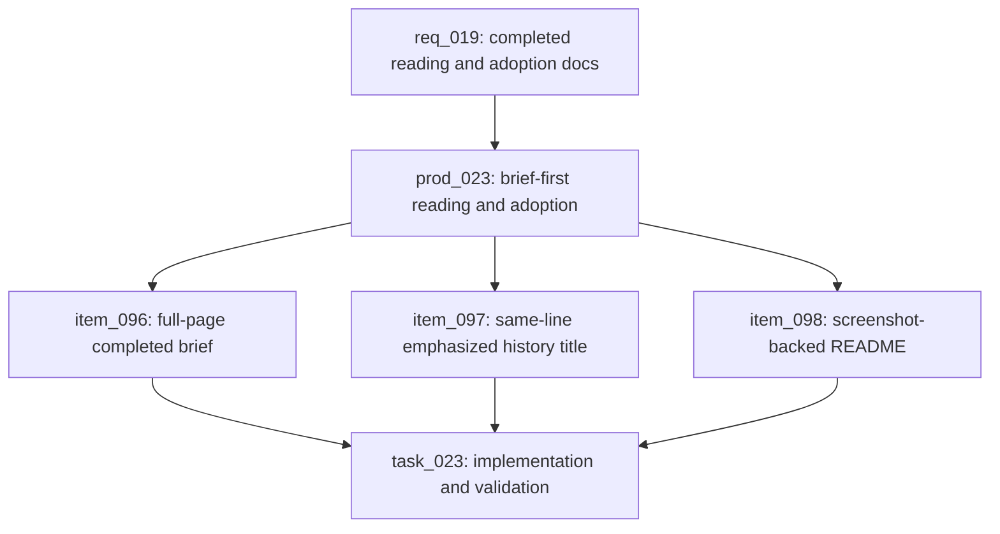

## prod_023_brief_first_claimlens_reading_and_adoption_documentation - Brief-first ClaimLens reading and adoption documentation
> Date: 2026-08-03
> Status: Settled
> Related request: `req_019_correct_the_completed_brief_reading_surface_and_promote_claimlens_documentation`
> Related backlog: `item_096_make_completed_briefs_genuinely_full_page_by_default`
> Related task: `task_023_orchestrate_completed_brief_full_page_correction_history_title_emphasis_and_readme_promotion`
> Related architecture: (none yet)
> Reminder: Update status, linked refs, scope, decisions, success signals, and open questions when you edit this doc.

# Overview
Turn the completed analysis page into a real reading surface, make history scan by human titles first, and make the README function as a convincing product guide.

# Goals
- Completed briefs should feel like the main artifact, not a preview embedded in leftover workflow chrome.
- History should let a returning user recognize analyses by video title before reading technical identifiers.
- The README should help a new user understand the problem ClaimLens solves, trust its workflow, and start using it.

# Non-goals
- Changing the analysis pipeline, evidence grading semantics, or database schema.
- Changing history retention, ownership, authentication, or authorization behavior.
- Adding new external services or changing deployment topology.

# Scope and guardrails
- In: completed brief layout, recoverable completed-run details, Recent analyses title presentation, README adoption narrative, screenshot references, focused tests, and validation.
- Out: pipeline behavior, evidence grading semantics, database schema, history retention, ownership, authentication, and deployment topology.

# Key product decisions
- The completed brief card itself must span the available workspace; readable text measure is controlled inside the card.
- Recent analyses should keep the video identifier visible, but the human video title should be the visual anchor.
- Documentation should explain why ClaimLens is worth using before it enumerates implementation details.
- Screenshot references should be checked in or use stable paths that can be regenerated after local server launch.

# Success signals
- Completed run rendering shows `report-complete` without the narrow report max-width constraint.
- History rows render `video_id : video title` in one primary line, with title emphasis and fallback behavior.
- README opens with value, workflow, screenshots, outputs, trust model, setup, and usage guidance.
- Focused rendering tests, full pytest suite, and Logics gates pass; unavailable local tools are recorded honestly.

# References
- Product back-reference: `item_096_make_completed_briefs_genuinely_full_page_by_default`
- Product back-reference: `item_097_make_recent_analysis_rows_title_first_and_same_line`
- Product back-reference: `item_098_rewrite_readme_as_a_screenshot_backed_product_guide`
- Task back-reference: `task_023_orchestrate_completed_brief_full_page_correction_history_title_emphasis_and_readme_promotion`
