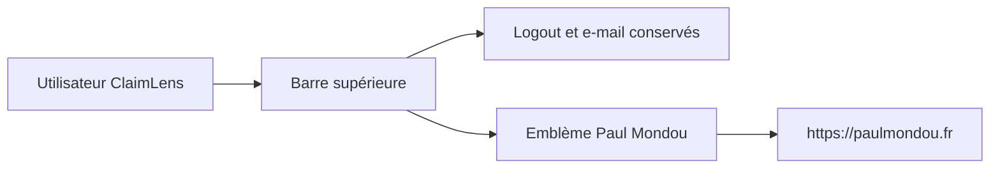

## prod_024_navigation_claimlens_reliee_au_site_parent - Navigation ClaimLens reliée au site parent
> Date: 2026-08-04
> Status: Settled
> Related request: `req_020_remplacer_l_avatar_de_compte_par_le_lien_paul_mondou`
> Related backlog: `item_099_remplacer_l_avatar_de_navigation_par_l_embleme_paul_mondou`
> Related task: `task_024_livrer_le_lien_parent_paul_mondou_dans_la_navigation_claimlens`
> Related architecture: (none yet)
> Reminder: Update status, linked refs, scope, decisions, success signals, and open questions when you edit this doc.
> Indicators reviewed: 2026-08-04

# Overview
La navigation conserve les contrôles de session utiles et remplace l'avatar décoratif par un lien de marque clair vers paulmondou.fr.

# Goals
- Supprimer l'élément de compte redondant sans perdre l'information ou les actions de session.
- Faire de l'emblème Paul Mondou une sortie identifiable, sûre et accessible vers le site parent.
- Conserver la densité et le comportement responsive de la barre actuelle.

# Non-goals
- Revoir la charte complète de ClaimLens ou remplacer son logo principal.
- Ajouter un menu de compte, modifier l'authentification ou changer les routes de session.
- Mettre en place une dépendance runtime vers le partage de fichiers personnel.

# Scope and guardrails
- In: asset PNG transparent versionné dans ClaimLens, lien externe dans `.navuser`, styles responsive, et tests de rendu de navigation.
- Out: logo ClaimLens, favicon, routes d'authentification, menu de compte et chargement runtime depuis le dossier source personnel.

# Key product decisions
- Utiliser `paulmondou-emblem-dark-transparent.png` comme source de l'asset versionné; ne jamais référencer le chemin WSL/Windows au runtime.
- Placer le lien à l'emplacement de l'avatar supprimé, avec le nom accessible `Visit paulmondou.fr`. Depuis la v1.8.1 il navigue dans l'onglet courant: aller sur le site parent est un départ assumé, réversible par le bouton Retour, et sans second onglet `noopener` n'a rien à protéger.
- Préserver l'e-mail et `Logout`; seul le visuel d'initiale disparaît.

# Success signals
- Les rendus connecté et invité ne contiennent plus `.avatar` ni une initiale d'e-mail, et portent tous deux le lien parent.
- Le lien parent, l'asset et ses attributs d'accessibilité/sécurité sont vérifiés par des tests.
- L'emblème reste stable, net et sans débordement sur les breakpoints existants.

# References
- Product back-reference: `item_099_remplacer_l_avatar_de_navigation_par_l_embleme_paul_mondou`
- Task back-reference: `task_024_livrer_le_lien_parent_paul_mondou_dans_la_navigation_claimlens`
