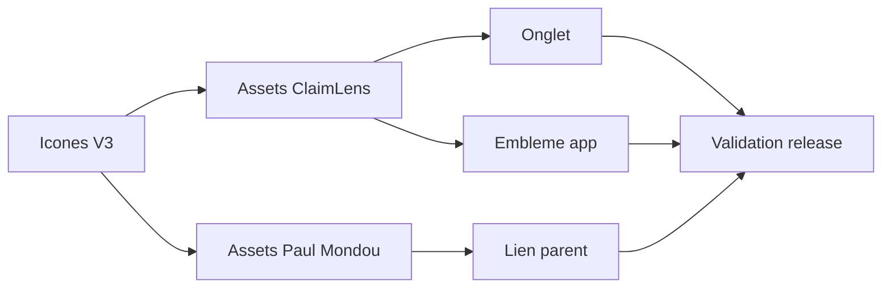

## prod_025_identite_claimlens_alignee_sur_icones_v3 - Identite ClaimLens alignee sur Icones V3
> Date: 2026-08-05
> Status: Proposed
> Related request: `req_021_integrer_les_icones_icones_v3_et_le_lien_parent_paul_mondou_dans_claimlens`
> Related backlog: `item_100_remplacer_favicon_et_embleme_claimlens_par_icones_v3`, `item_101_finaliser_le_lien_paul_mondou_avec_l_identite_icones_v3`
> Related task: `task_025_orchestrer_l_integration_icones_v3_dans_claimlens`
> Related architecture: (none yet)
> Reminder: Update status, linked refs, scope, decisions, success signals, and open questions when you edit this doc.

# Overview
ClaimLens remplace ses icones visibles et son lien parent par les assets du corpus Icones V3.

# Goals
- Unifier favicon, embleme et lien parent avec le nouveau corpus d'icones.
- Preserver les parcours d'analyse et l'etat de production existant.
- Rendre le remplacement validable par build et verification d'assets.

# Non-goals
- Modifier les workflows de verification de sources ou d'analyse.
- Refondre l'espace de lecture du brief au-dela des assets de marque.

# Scope and guardrails
- In: scaffolded request, product, backlog, orchestration task, validation, and handoff context.
- Out: unrelated workflow docs and implementation of generated tasks.

# Key product decisions
- Use structured input as the source of truth for generated docs.
- Keep generated write paths local and repo-bounded.

# Success signals
- Generated docs pass lint and audit without broad manual rewrites.
- Context-pack output can be handed to an implementation agent directly.

# References
- Product back-reference: `req_021_integrer_les_icones_icones_v3_et_le_lien_parent_paul_mondou_dans_claimlens`
- Task back-reference: `task_025_orchestrer_l_integration_icones_v3_dans_claimlens`
